<h1 align="center">Hi 👋, I'm Hyunggi</h1>

## 🌱 Interests
- **Simultaneous Localization and Mapping (SLAM)**
  - Visual SLAM, LiDAR SLAM, Semantic SLAM, Learning-based odometry and mapping
- **Computer Vision**
  - Multiple view geometry, Pose estimation, Deep features
- **Deep Learning**
  - Large language model (LLM), Visual language model (VLM), Visual language action model (VLA)
- **Compute Hardware**
  - Graph processors, SIMD, RISC-V

## 🔭 Careers
- Sr. Field Application Engineer at [**Tenstorrent**](https://github.com/tenstorrent) (2025 - PRESENT)
- Algorithm Engineer at StradVision (2021 - 2025)
- Algorithm Engineer at VIRNECT (2019 - 2021)
- Research Intern at the Bohndiek Lab, Cavendish Laboratory, University of Cambridge (2019)
- M.Res degree in Medical Robotics and Image-Guided Intervention at the Hamlyn Centre, Imperial College London(2017-2018)
- B.Eng degree in Manufacturing and Mechanical Engineering at the University of Warwick (2014-2017)

## ⚡ Community Activities
- Admin of a Physical AI / SLAM research community group: [**'Physical AI KR'**](https://open.kakao.com/o/g8T5kxLb)
- Personal research blog (Korean): [**cv-learn blog**](https://www.cv-learn.com)

## 📫 Contacts
- LinkedIn: [Link](https://www.linkedin.com/in/hyunggi-chang/)
- Facebook: [Link](https://www.facebook.com/harry.chang.982/)

<!--
**changh95/changh95** is a ✨ _special_ ✨ repository because its `README.md` (this file) appears on your GitHub profile.

Here are some ideas to get you started:

- 🔭 I’m currently working on ...
- 🌱 I’m currently learning ...
- 👯 I’m looking to collaborate on ...
- 🤔 I’m looking for help with ...
- 💬 Ask me about ...
- 📫 How to reach me: ...
- 😄 Pronouns: ...
- ⚡ Fun fact: ...
-->

